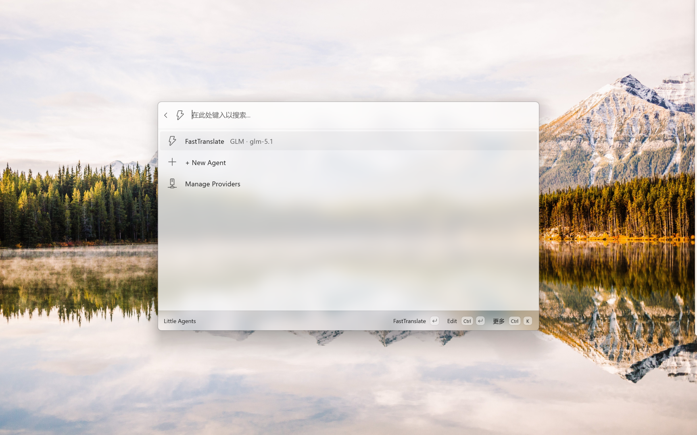

# Little Agents

## Description

Little Agents is a PowerToys Command Palette extension for saving prompt templates as named agents and invoking any OpenAI-compatible LLM from Command Palette.

Each agent stores a system prompt, a user template, a provider, and a model name. When you run an agent from Command Palette, Little Agents renders the template, sends it to the configured chat completions endpoint, and shows the reply in the run page.


## Requirements

PowerToys with Command Palette v0.100+ installed.

## Supported Providers

Little Agents can call any service that exposes an OpenAI-compatible `/v1/chat/completions` endpoint. The provider base URL should include the API root, including `/v1` when the service expects it. The request layer appends `/chat/completions` after that base URL.

Remote provider URLs must use HTTPS. Plain HTTP is accepted only for loopback providers such as `localhost`, `127.0.0.0/8`, or `::1`.

Worked configuration examples:

| Provider | Base URL | Model example | Notes |
| --- | --- | --- | --- |
| OpenAI | `https://api.openai.com/v1` | `gpt-4.1-mini` | Uses `POST https://api.openai.com/v1/chat/completions`. |
| OpenRouter | `https://openrouter.ai/api/v1` | `openai/gpt-4.1-mini` | Uses `POST https://openrouter.ai/api/v1/chat/completions`. |
| Ollama | `http://localhost:11434/v1` | `llama3.1` | Use local HTTP unless you have a trusted certificate. |

Other OpenAI-compatible providers, such as DeepSeek, can be configured the same way if they expose `/v1/chat/completions`.

## Template Variables

Little Agents supports these template variables:

| Variable | Meaning |
| --- | --- |
| `{input}` | Text you type each time you invoke the agent. |
| `{selection}` | Current Windows clipboard text, capped at 8,000 characters. |

Examples:

```text
Translate to English: {selection}
Summarize this: {input}
```

## Limitations

Little Agents does not support images, audio, tool calls, RAG, document upload, cost tracking, or provider model auto discovery.

Individual assistant responses are capped at 256,000 characters to prevent a provider from exhausting extension memory. Clipboard text is bounded before it is copied into managed memory and remains capped at 8,000 characters in rendered prompts.

Little Agents does not bypass TLS certificate validation. For loopback providers without a trusted certificate, use `http://localhost`; all remote providers require HTTPS.

## Privacy

Little Agents stores configuration locally and sends prompts directly to the
OpenAI-compatible provider selected by the user. See the [Privacy Policy](PRIVACY.md)
for details about local storage, API credentials, clipboard access, and provider
data transmission.

## License

MIT. See `LICENSE`.

## Development

- [Development guide](docs/DEVELOPMENT.md)
- [Microsoft Store publishing guide](docs/PUBLISHING.md)

## Screenshots


